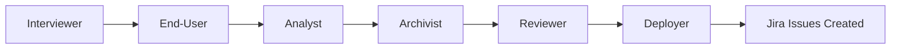

# AGENTS.md

This file provides guidance to AI coding agents working with this project. It follows the universal AGENTS.md standard adopted by 40,000+ open-source projects and supported by Claude Code, Cursor, Copilot, Windsurf, and other AI development tools.

## Overview

This project follows an **agent-driven development workflow** where AI agents:
1. Elicit and document requirements through stakeholder interaction
2. Set up and maintain project management in Jira (via Atlassian MCP)
3. Create and manage GitHub branches tied to Jira issues
4. Commit regularly using smart commits for traceability
5. Update Jira issues to reflect project state
6. Manage merges across development branches (dev, staging, main)

## Build & Test

```bash
# Node.js projects
npm install
npm run dev
npm run build
npm test

# Laravel projects
composer install
php artisan migrate
php artisan serve
php artisan horizon  # For queue processing
php artisan test
./vendor/bin/pint    # Code formatting

# Python projects
conda create -n [project-name] python=3.10
conda activate [project-name]
pip install -r requirements.txt
pytest

# React Native projects
yarn install
yarn start
yarn ios
yarn android
```

## Architecture Overview

### Multi-Stack Environment
- **Frontend**: React, Next.js, React Native with TypeScript
- **Backend**: Laravel (PHP), Node.js/Express
- **Databases**: MySQL, PostgreSQL, MongoDB, SQLite
- **AI/ML**: Python with PyTorch, OpenAI APIs
- **Infrastructure**: Docker, AWS services

### Key Architectural Patterns
- **Team-based Multi-tenancy**: All features scoped to teams
- **State Machines**: Workflow management through dedicated state classes
- **Job Batching**: Background processing with comprehensive tracking
- **MCP Integration**: Model Context Protocol servers for tool integration

## Agentic Workflow Patterns

### 1. Sequential Workflows
Tasks decomposed into step-by-step subgoals where each output becomes the next step's input.

**Use cases:**
- Feature implementation with multiple stages
- Data processing pipelines
- Multi-file refactoring operations

### 2. Planning Patterns
Agents autonomously plan multi-step workflows, execute each stage, review outcomes, and adjust in a "plan-do-check-act" loop.

**Implementation:**
- Use TodoWrite tool for planning and tracking
- Mark todos as in_progress before starting
- Complete todos immediately after finishing
- Update plan when encountering blockers

### 3. Parallelization
Split large tasks into independent sub-tasks for concurrent execution.

**Use cases:**
- Code review across multiple files
- Running multiple test suites
- Parallel API requests
- Multi-file searches

### 4. Orchestrator-Worker Pattern
Central orchestrator breaks tasks down, assigns work to specialized workers, then synthesizes results.

**Use cases:**
- RAG (Retrieval-Augmented Generation)
- Complex code generation
- Multi-modal research tasks

## Requirements Elicitation Process

### Phase 1: Stakeholder Discovery
1. **Identify stakeholders** and their roles
2. **Gather context** about project scope and objectives
3. **Document assumptions** and constraints
4. **Define success criteria**

### Phase 2: Requirements Gathering
Use multi-agent approach with distinct roles:

- **Product Owner Agent**: Introduces user stories, organizes meetings
- **Developer Agent**: Assesses technical feasibility, identifies dependencies
- **QA Agent**: Validates quality, identifies edge cases
- **Manager Agent**: Prioritizes requirements, manages scope

### Phase 3: Documentation
1. Create comprehensive requirements document
2. Generate user stories with acceptance criteria
3. Document functional and non-functional requirements
4. Create use-case models and specifications

### Phase 4: Validation
1. Review requirements with stakeholders
2. Iterate based on feedback
3. Prioritize features by business value
4. Create Jira issues from validated requirements

## Jira Integration via MCP

### Setup
```bash
# Atlassian MCP server enables direct Jira interaction
# Configure in Claude Desktop or agent runtime
```

### Capabilities
- **Create issues**: Generate Jira tickets from requirements
- **Search issues**: Query using JQL (Jira Query Language)
- **Update issues**: Modify fields, add comments, log time
- **Bulk operations**: Create/update multiple issues at once
- **Sprint management**: Get sprint progress, analyze workload
- **Reporting**: Generate daily standup reports

### Workflow
1. Elicit requirements → Create Jira issues with proper fields
2. Before coding → Select issue from backlog
3. During development → Update issue status via smart commits
4. After completion → Transition issue to done, add completion comment
5. Continuous → Keep Jira as source of truth for project state

## Git Workflows

### Branch Naming Convention
Follow this strict pattern for all branches:

```
<type>/<JIRA-KEY>-<short-description>

Examples:
feature/PROJ-123-user-authentication
fix/PROJ-456-database-connection
hotfix/PROJ-789-critical-bug
bugfix/PROJ-234-ui-alignment
```

**Types:**
- `feature/` - New functionality
- `fix/` - Bug fixes (non-critical)
- `hotfix/` - Critical production fixes
- `bugfix/` - Non-critical bug fixes
- `refactor/` - Code refactoring
- `docs/` - Documentation updates
- `test/` - Test additions/modifications

**Rules:**
- Always include Jira issue key (e.g., PROJ-123)
- Use lowercase with hyphens
- Keep description short (3-5 words max)
- Create branch before starting work on issue

### Smart Commits Syntax

Smart commits automatically update Jira from Git commit messages:

```bash
# Basic format
<JIRA-KEY> #<command> <arguments>

# Add comment
git commit -m "PROJ-123 #comment Implemented user authentication"

# Log time
git commit -m "PROJ-123 #time 2h 30m Completed authentication module"

# Transition workflow + comment
git commit -m "PROJ-123 #done #comment Testing complete, ready for review"

# Multiple commands
git commit -m "PROJ-123 #time 1h #comment Fixed database connection #in-review"
```

**Commands:**
- `#comment <text>` - Add comment to issue
- `#time <value>w <value>d <value>h <value>m` - Log work time
- `#<transition>` - Move issue (e.g., #in-progress, #done, #in-review)

**Requirements:**
- Git email must match exactly one Jira user account
- Committer must have appropriate Jira permissions
- Transitions must match Jira workflow state names

### Branching Strategy

```
main (production)
  ├── staging (pre-production)
  │     ├── dev (development)
  │     │     ├── feature/PROJ-123-new-feature
  │     │     ├── fix/PROJ-456-bug-fix
  │     │     └── refactor/PROJ-789-code-cleanup
```

**Workflow:**
1. Create feature branch from `dev`
2. Commit regularly with smart commits to update Jira
3. Open PR to `dev` when feature complete
4. After code review, merge to `dev`
5. Periodically merge `dev` → `staging` for QA
6. After QA approval, merge `staging` → `main`

**Automation:**
- CI/CD triggers on branch patterns (`feature/**` → run tests)
- Deployment pipelines (`staging/**` → deploy to staging env)
- Release notes generation from commit messages

## Conventions & Patterns

### Code Style
- **Logging**: Always lowercase
- **Error States**: Proper error UI, no toast notifications
- **Loading States**: Skeleton states, proper disabled states
- **Comments**: Only for complex logic, code should be self-documenting
- **TypeScript**: Required for type safety

### File Organization
```
src/
  ├── components/     # Reusable UI components
  ├── services/       # Business logic and API calls
  ├── utils/          # Helper functions
  ├── types/          # TypeScript definitions
  └── config/         # Configuration files
```

### Laravel Specific
- Use **Laravel Actions** for business logic
- Keep controllers thin
- State machines drive UI and business logic
- Team isolation for all user-facing features
- Always run `php artisan horizon` for queue processing

### React/TypeScript Specific
- Use **Tailwind CSS** for consistent styling
- Zustand for state management (React Native)
- Proper TypeScript types, avoid `any`
- Component-based architecture

## Agentic Primitives

### Context Files
Use specialized markdown files for different purposes:

- **`.instructions.md`** - Repository-specific guidance
- **`.chatmode.md`** - Role-based expertise with tool boundaries
- **`.prompt.md`** - Reusable prompts with validation
- **`.spec.md`** - Implementation-ready blueprints
- **`.memory.md`** - Cross-session knowledge preservation
- **`.context.md`** - Optimized information retrieval

### Markdown Prompt Engineering
Structure agent interactions using:
- **Headers** for logical sections
- **Lists** for sequential steps
- **Code blocks** for exact commands
- **Links** to external documentation
- **Validation gates** requiring human approval

### Session Management
- **Split sessions** for different development phases
- **Preserve context** across agent interactions
- **Use memory files** to maintain state between sessions
- **Apply modular instructions** based on file types

## Security

### API Keys and Authentication
- Never commit secrets to version control
- Use environment variables for sensitive data
- Laravel: `.env` file (not in git)
- Node: `.env.local` (not in git)
- Store production secrets in secure vault (AWS Secrets Manager, 1Password)

### Rate Limits
- OpenAI API: Monitor usage in dashboard
- GitHub API: Respect rate limits, use authentication
- Jira API: OAuth tokens with appropriate scopes

## Agent Collaboration Best Practices

### Communication
1. **Ask questions early** using AskUserQuestion tool
2. **Provide regular updates** on progress
3. **Document assumptions** in comments or memory files
4. **Surface blockers immediately**

### Task Management
1. **Always use TodoWrite** for complex tasks
2. **Break down large tasks** into manageable steps
3. **Mark todos in_progress** before starting
4. **Complete todos immediately** when done
5. **Update plan** when discovering new subtasks

### Code Quality
1. **Run tests** before committing
2. **Use proper error handling** - no silent failures
3. **Check for security vulnerabilities** (XSS, SQL injection, etc.)
4. **Follow existing patterns** in the codebase
5. **Document breaking changes**

### Jira Updates
1. **Update issue status** with every commit (via smart commits)
2. **Log time accurately** using #time command
3. **Add meaningful comments** about progress and blockers
4. **Keep issues current** with actual development state
5. **Link related issues** for traceability

## Multi-Agent Requirements Engineering

When eliciting requirements, deploy specialized agents:

### Agent Roles
1. **Interviewer Agent**: Conducts stakeholder interviews, asks clarifying questions
2. **End-User Agent**: Simulates user perspectives and use cases
3. **Analyst Agent**: Analyzes requirements for completeness and consistency
4. **Archivist Agent**: Documents requirements in structured format
5. **Reviewer Agent**: Validates requirements quality and feasibility
6. **Deployer Agent**: Creates Jira issues and project structure

### Workflow


### Validation Loop
- Continuous feedback between stakeholders and agents
- Iterative refinement of requirements
- Human-in-the-loop for critical decisions
- Quality gates before moving to next phase

## Integration Points

### MCP Servers Available
- **Atlassian MCP**: Jira and Confluence integration
- **GitHub MCP**: Repository and issue management
- **Memory MCP**: Persistent knowledge across sessions
- **n8n MCP**: Workflow automation

### External Tools
- **GitHub**: Version control, CI/CD, code review
- **Jira**: Project management, issue tracking
- **Slack**: Team communication, notifications
- **AWS**: Cloud infrastructure, storage

## Version Control

This AGENTS.md file should be:
- Committed to repository root
- Updated when project patterns change
- Reviewed during onboarding
- Referenced by all agent interactions
- Maximum ~200 lines (use links for details)

---

**Last Updated**: 2025-11-08
**Framework Version**: 1.0.0
**Standard**: AGENTS.md Universal Standard
